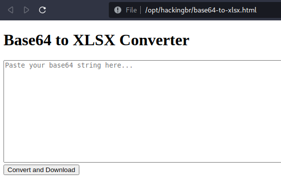

    <a href="https://github.com/carineconstantino/hackingbr">@hackingbr</a>

## Base64 Converter
Base64 Converter é uma ferramenta para converter o código em formato Base64 para arquivo .xlsx. A ferramenta funciona offline, garantindo maior segurança aos dados decodificados.  

## Exemplo

#

