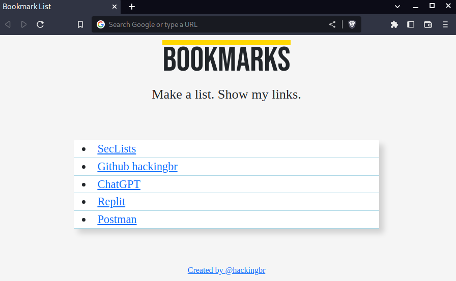

<p align="center">
    <p></p>
    <a href="https://github.com/carineconstantino/hackingbr">@hackingbr></a>
</p>

## Bookmark List Extension
A extensão Bookmark List cria uma lista com os links armazenados no navegador. O objetivo da ferramenta é permitir o acesso rápido aos links salvos.  

## Como usar? 

### Pré-Requisito
[+] Para fazer o downloado apenas do diretório bookmark-list, use a ferramenta SVN
```
apt update

apt-get install svn
```
[+] Depois que a ferramenta SVN for instalada, execute as etapas abaixo

```
1.Escolha um diretório para armazenar os arquivos
cd /opt

2.Faça o download
git svn clone https://github.com/carineconstantino/hackingbr/trunk/bookmark-list-extension/bookmarkList

3.Acesse a área de extensão do navegador

4.Habilite o modo desenvolvedor

5.Faça a importação do diretório da extensão

```
## Nota
Para facilitar a visualização dos links, recomendo usar definir títulos para os links salvos. 
#

