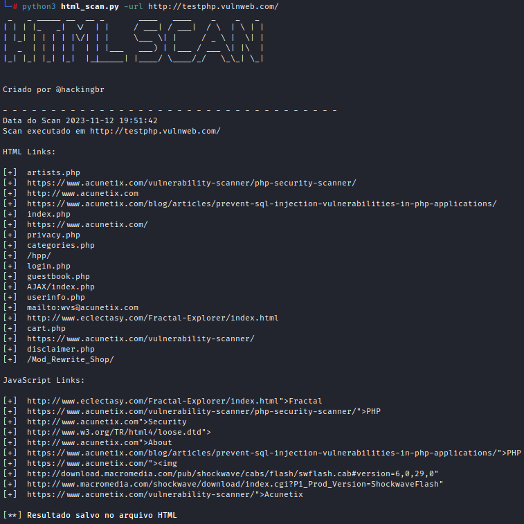
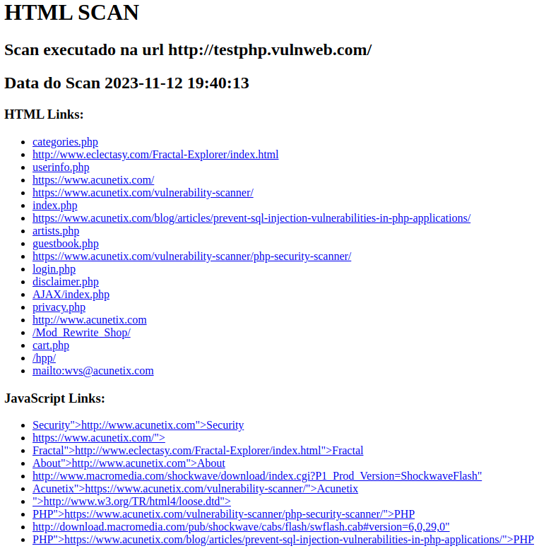

<p align="center">
    <p></p>
    <a href="https://github.com/carineconstantino/hackingbr">@hackingbr></a>
</p>

## HTML
HTML Scan é uma ferramenta em python para extrair links e arquivos de páginas HTML e arquivos JavaScript. Realiza o scan no HTML para coletar informações na fase inicial da avaliação de segurança. Identifica outras urls usadas pelo site, endereços de API, repositório S3, páginas administrativas, os arquivos e diretórios usados na estrutura da página. 

## Exemplo
```
python3 html_scan.py -url exemplo.com
```
### Resultado na CLI
<p align="left">
    <p></p>
</p>

### Resultado no HTML
<p align="left">
    <p></p>
</p>

#


