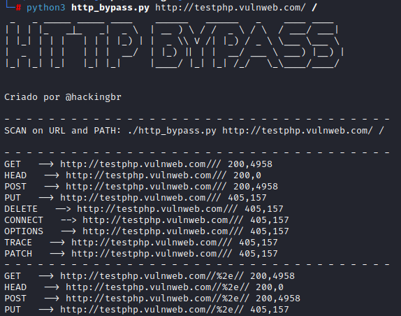
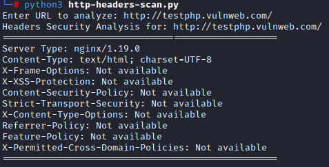

<p align="left">
    <a href="https://github.com/carineconstantino/hackingbr">@hackingbr></a>
</p>

## HTTP Bypass
HTTP Bypass é uma ferramenta em python para testar diversos métodos HTTP em uma requisição e, em seguida, a ferramenta realiza um brute-force usando diversos métodos HTTP para tentar fazer o bypass do acesso. 

## Exemplo
```
python3 http_bypass.py [url]
```
### Resultado
<p align="left">
    <p></p>
</p>

## HTTP Headers Scan
HTTP Headers Scan é uma ferramenta em python que analisa o cabeçalho HTTP e indica os parâmetros que estão ausentes. 

## Exemplo
```
python3 http-headers-scan.py
```
<p align="left">
    <p></p>
</p>

#


