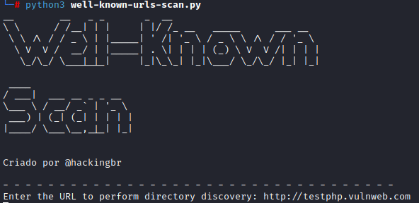

<p align="center">
    <p></p>
    <a href="https://github.com/carineconstantino/hackingbr">@hackingbr></a>
</p>

## Well-Known Scan Tool
Well-Known Scan é uma ferramenta para mapear os diretórios e arquivos com metadados do site conhecidos como Well-Known uri. Quando configurados no site, os arquivos e diretórios são encontrados no endpoint /.well-known/. Os metadados armazenados nesse recurso podem revelar informações relevantes sobre uma aplicação. 

## Exemplo
```
python3 well-known-scan.py
```
<p align="left">
    <p></p>
</p>

