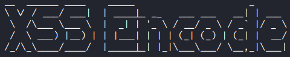

<p align="center">
    <p></p>
    <a href="https://github.com/carineconstantino/hackingbr">@hackingbr></a>
</p>

## XSS Encode Tool
XSS Encode é uma ferramenta em python para testar se uma página é vulnerável ao ataque de XSS do tipo refletido. A partir de uma lista de payloads, a ferramenta executa testes no parametro da URL e consegue identificar quando a página é vulnerável. No código do payload é aplicado o formato url-encode para o bypass de filtros de WAF - Web Application Firewall. 

## Exemplo
XSS Encode usa uma wordlist customizada 
```
python3 xss_encode.py --url exemplo.com --p cat
```
### XSS Refletido identificado
<p align="left">
    <p></p>
</p>

#

